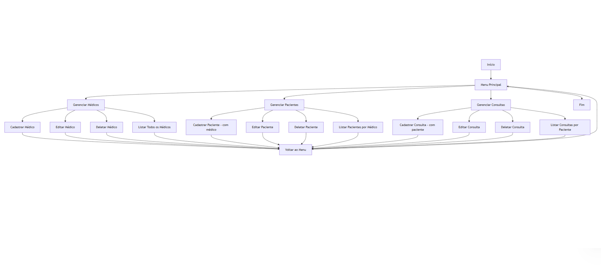

# _Sistema de Hospital_


---

## Sumário

- [Histórico de Versão](#histórico-de-versão)
- [Introdução](#introdução)
- [Objetivo](#objetivo)
- [Estrutura do Projeto](#estrutura-do-projeto)
- [Links de Estudo](#links-de-estudo)
- [Fluxograma](#fluxograma)
- [Instale Git](#instale-git)
  - [Configuração Básica do Git](#configuração-básica-do-git)
- [Ambiente Virtual com venv](#ambiente-virtual-com-venv)
  - [Instale o Python](#instale-o-python)
  - [Crie um Ambiente Virtual](#crie-um-ambiente-virtual)
  - [Ative o Ambiente Virtual](#ative-o-ambiente-virtual)
  - [Instale Pacotes](#instale-pacotes)
  - [Desative o Ambiente Virtual](#desative-o-ambiente-virtual)
  - [Remover o Ambiente Virtual](#remover-o-ambiente-virtual)
  - [Notas Adicionais](#notas-adicionais)
  - [Pacotes Python](#pacotes-python)
- [Configuração de Software](#configuração-de-software)
- [Informações](#informações)

## Histórico de versão

| Versão | Data       | Autor        | Descrição            |
|--------|------------|--------------|----------------------|
| 1.0.0  | 30/05/2025 | Adenilton R  | Início do Projeto    |

## Introdução

Este é um projeto Python desenvolvido para demonstrar, de forma prática, o funcionamento de um Sistema de Gestão Hospitalar, utilizando arquitetura RESTful. O sistema permite o cadastro, edição, exclusão e listagem de médicos, pacientes e consultas, com relacionamento entre essas entidades e persistência em banco de dados relacional. O projeto está sendo desenvolvido em ambiente Linux utilizando WSL (Windows Subsystem for Linux) ou Windows.

## Objetivo

O objetivo deste projeto é **oferecer uma solução simples e funcional** para o gerenciamento de atendimentos hospitalares, possibilitando:

- O cadastro de médicos com suas especialidades e CRM;
- O vínculo de pacientes a médicos responsáveis;
- O agendamento e registro de consultas associadas a pacientes;
- A visualização organizada de todas essas informações, mantendo integridade dos dados e boa estrutura de código.

## Estrutura do Projeto

Aqui está uma visão geral da estrutura básica do projeto:

```
sistema_hospital/
├── README.md                        # Descrição do projeto e instruções de uso
├── main.py                          # Arquivo principal (inicia a aplicação Flask)
├── requirements.txt                 # Dependências do projeto (Flask, etc.)
├── src/                             # Código-fonte principal
│   ├── controllers/                 # Lógica de controle e rotas Flask (camada REST)
│   │   ├── __init__.py
│   │   ├── medico_controller.py
│   │   ├── paciente_controller.py
│   │   └── consulta_controller.py
│   ├── models/                      # Definições das entidades e ORM (ex: SQLAlchemy)
│   │   ├── __init__.py
│   │   ├── medico.py
│   │   ├── paciente.py
│   │   └── consulta.py
│   ├── services/                    # Regras de negócio e operações principais
│   │   ├── __init__.py
│   │   ├── medico_service.py
│   │   ├── paciente_service.py
│   │   └── consulta_service.py
│   └── utils/                       # Utilitários auxiliares (validações, helpers, etc.)
│       ├── __init__.py
│       └── helpers.py
├── database/                        # Inicialização e conexão com o banco de dados
│   ├── __init__.py
│   └── db_config.py
├── config/                          # Configurações do projeto (ex: conexão, ambiente)
│   └── settings.json
├── tests/                           # Testes automatizados
│   ├── __init__.py
│   ├── test_medico.py
│   ├── test_paciente.py
│   └── test_consulta.py
└── scripts/                         # Scripts de manutenção (seed, migração, etc.)
    └── populate_db.py
```

## Links de Estudo

[**Desenvolvimento Web - Frameworks;**](https://github.com/caio-ireno/Desenvolvimento-web-FACENS-2025-1/tree/main)

`Link`para adicionar

## Fluxograma



## Instale Git

Instale o Git com o seguinte comando:

```basic
sudo apt install git -y
```

Para garantir que o Git foi instalado corretamente, verifique a versão instalada com:

```basic
git --version
```

### Configuração Básica do Git

Após a instalação, é importante configurar o Git usando SSH:

[Link do vídeo explicando;](https://www.youtube.com/watch?v=xN3Hl4syCjs)

[Link de um artigo;](https://willianjusten.com.br/configurando-2-contas-de-git-no-mesmo-computador)

## Ambiente Virtual com venv

Para criar e gerenciar um ambiente virtual usando `venv`, siga os passos abaixo:

### Instale o Python

Certifique-se de que o Python está instalado no seu PC. A maioria das distribuições do Linux já vem com o Python pré-instalado. Caso precise instalar ou atualizar, execute, v3.11.2:

```bash
sudo apt update
sudo apt install python3 python3-venv
```

### Crie um Ambiente Virtual

1. **Abra um Terminal no PC.**
2. Navegue até sua pasta para clonar o projeto:
    
    ```basic
    cd GitHub/projetos
    ```
    
3. Clone o repositorio:
    
    ```basic
    git clone https://github.com/Projetos/meus-projetos.git
    ```
    
4. Navegue até a pasta Software:
    
    ```basic
    cd Projeto/Software
    ```
    
5. **Execute o Comando para Criar o Ambiente Virtual:**
    - Substitua `nome_do_seu_ambiente` pelo nome desejado para o seu ambiente virtual, nome do meu ambiente é `web`.
    
    ```bash
    python3 -m venv web
    ```
    
    Isso criará uma pasta chamada `nome_do_seu_ambiente` contendo o ambiente virtual.
    

### Ative o Ambiente Virtual

Para ativar o ambiente virtual, execute o comando apropriado para o seu sistema:

```bash
source nome_do_seu_ambiente/bin/activate
```

Após a ativação, você verá o nome do ambiente virtual aparecer no prompt do terminal, indicando que você está trabalhando dentro do ambiente virtual.

### Instale Pacotes

Com o ambiente virtual ativado, você pode instalar pacotes usando `pip`. Por exemplo:

```bash
pip install nome_do_pacote
```

### Desative o Ambiente Virtual

Para desativar o ambiente virtual e retornar ao ambiente global do Python, execute:

```bash
deactivate
```

### Remover o Ambiente Virtual

Se você precisar excluir o ambiente virtual, basta remover a pasta que foi criada. No exemplo acima, você pode excluir a pasta `nome_do_seu_ambiente`:

```bash
rm -rf nome_do_seu_ambiente
```

### Notas Adicionais

- **Gerenciamento de Pacotes:**
    - Use `pip list` para listar pacotes instalados e `pip freeze` para gerar um arquivo `requirements.txt` com as dependências do projeto.
- **Arquivo `requirements.txt`:**
    - Para gerar um arquivo `requirements.txt`, execute:
        
        ```bash
        pip freeze > requirements.txt
        ```
        
    - Para instalar pacotes a partir de um `requirements.txt`, use:
        
        ```bash
        pip install -r requirements.txt
        ```
        

Para ativar o ambiente virtual, execute o comando apropriado para o seu sistema:

```bash
source web/bin/activate
```

Para desativar o ambiente virtual e retornar ao ambiente global do Python, execute:

```bash
deactivate
```

### Pacotes Python

[Flask](https://flask.palletsprojects.com/en/3.0.x/), v3.0.3

```bash
pip install Flask
```

## Configuração de Software

### Estrutura do Projeto

dentro do caminho crie as pasta para o projeto:

```basic
cd Software/Python
```

Pasta templates:

```basic
mkdir templates
```

Cria os rquivos HTML dentro de templates:

```basic
vim homepage.html
```

Cliar arquivos .py

```basic
vim main.py
```

Pasta static/img:

```basic
mkdir static
```

```basic
cd static
```

```basic
mkdir img
```

Cliar arquivos main.py

```basic
vim main.py
```

Cliar arquivos README.md

```basic
vim README.md
```


- Código main.py:
    
    ```python
    '''
     * NOME: Nomes
     * DATA: 30/05/2025
     * PROJETO: Flask Web
     * VERSAO: 1.0.0
     * DESCRICAO: - feat: Criar página  de exemplos.
     * LINKS: 
    '''
    
    from flask import Flask, render_template, request
    
    app = Flask(__name__)
    
    @app.route("/")
    def homepage():
    
        return render_template("homepage.html")
    
    if __name__ == '__main__':
        app.run(host='0.0.0.0', debug=True)
    ```
    
- Código HTML - homepage:
    
    ```html
    <!DOCTYPE html>
    <html lang="pt-br">
    <head>
        <meta charset="UTF-8">
        <meta name="viewport" content="width=device-width, initial-scale=1.0">
        <title>Homepage</title>
    </head>
    <body>
        <h1><center>Olá Mundo!</h1>
        <hr>
        <h3>Esse é meu primeiro documento em HTML usando Flask</h3>
        <p>Este é um monento único!</p>
    </body>
    </html>
    ```
    

Para pode rodar o código, digite os seguintes comandos:

```basic
python main.py
```

Para poder fechar a aplicação só dar **`Ctrl + c`**:

## Informações

| Software | Versão  |
|----------|---------|
| Python   | v3.11.2 |
| Flask    | v3.0.3  |
